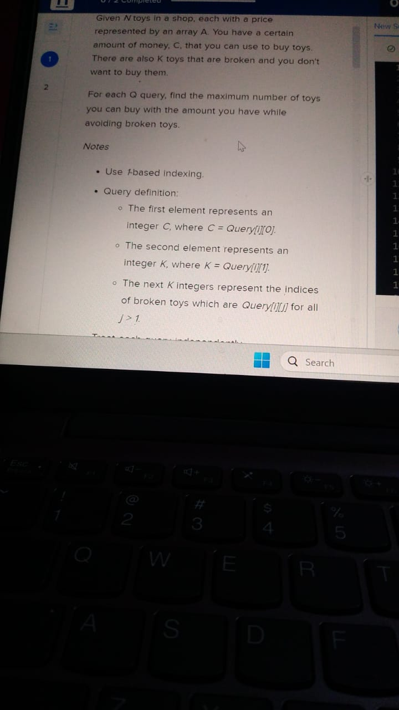
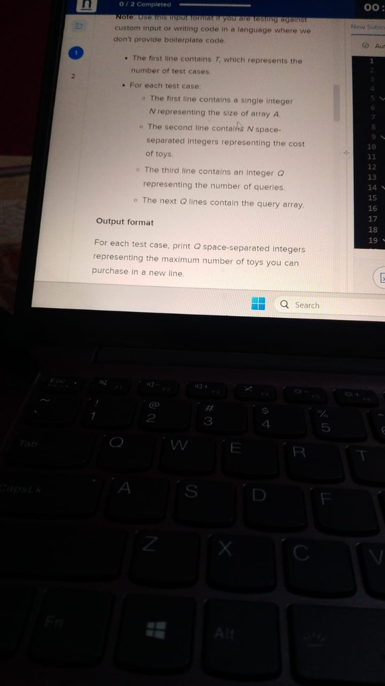
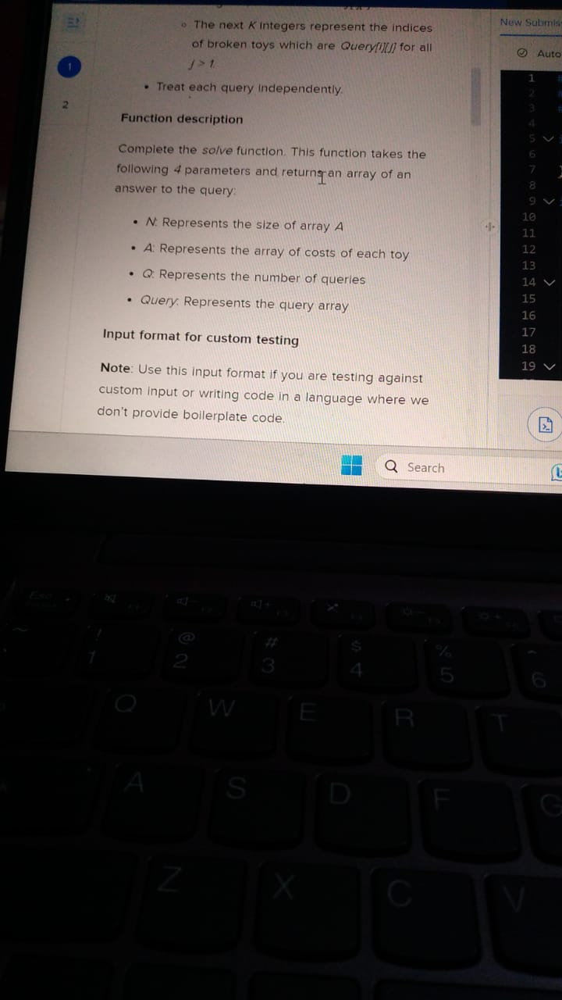
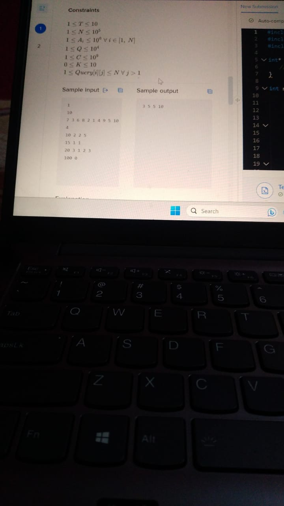

# Google Hiring Process

Pay and Duration

Pay: 1.14L/month
    
Duration: 8-10 weeks

## OA

### Questions

1. 

2. 

3. 

4. 

See [this](https://leetcode.com/discuss/interview-question/3760132/Google-SWE-Intern-OA-2023-(India)-Both-Questions) for more questions in this year's Google rounds.

### Solutions

Q1

Straight forward 2D-dp.
States: Indexes of the two arrays

Q2

See <a href = "https://leetcode.com/discuss/interview-question/3767717/google-intern-swe-2023-OA"> this </a>

Q3

Straight forward Dijkstra.
Calculate unique prime factors using sieve (upto 1e3 should work, then see primality of the by division by primes lesser than 1e3), then run a loop for making the edges, since p <=7. Then apply dijkstra.

Q4

Maintain a segment tree of the prefix sum, do cost of broken toys = 0 in a query. Find the index whose prefix sum is just than the amt to be paid and subtract the # of broken toys whose index is less than this index to answer the query.

More discussions and questions:
1. [Google Online Assessment Questions](https://leetcode.com/discuss/interview-question/352460/Google-Online-Assessment-Questions)

2. [Special Subsequence](https://leetcode.com/discuss/interview-question/3771949/Google-intern-OA-Problem-15072023-(Special-Subsequence)-Anyone-Please-help-how-to-solve-it) and [another discussion on the same](https://leetcode.com/discuss/interview-question/3759965/Google-Internship-OA)